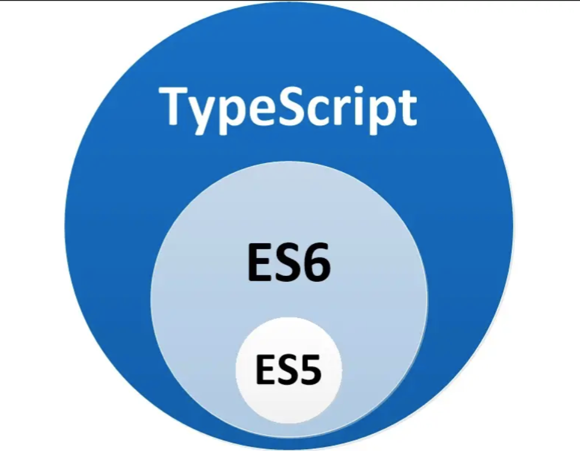

## 简介
这是一个用来学习 `TypeScript` 的项目。

## 笔记

### 认识 TypeScript

- 由**微软**的 Anders Hejlsberg（安德斯·海尔斯伯格）于 `2012 年`领导团队开发，于 `2014 年` 正式在 GitHub 上开源。
- JavaScript 的超集。
  
- TypeScript 的特点和优势
  - 静态类型检查： 它让 JavaScript 由动态类型变为静态类型。这能避免类型变化带来的错误，比如数字变成字符串后运算方式会不一样。
  - 面向对象编程特性：支持完全的类（class）和类的继承（extends），不同于 ES6 中的 class 和 extends 只是一个语法糖。拓展出了 interface 类型，方便操作对象。class 配合 `implements` 关键字可以让类遵循接口定义。
- TypeScript 的强大和伟大之处就在于它的类型系统。
- 严谨又不失灵活。
- 它不是强类型语言，因为它允许隐式转换的存在，而强类型语言是不允许隐式转换的存在的。

### 关于配置文件 tsconfig.json

- `tsconfig.json` 是 `TypeScript` 编译配置文件。
- `tsconfig.json` 常见配置项：
  - "compilerOptions"：这是一个对象，里面有多个属性，用于指定编译规则，如 `target` 是用来指定编译后的文件所采用的 ES 标准，`outDir` 用来指定编译文件所在目录。
  - 
- 要想让 `tsconfig.json` 生效，需要利用 “-p” 或 “--project” 命令后缀指定 `tsconfig.json` 文件路径。
  

### 关于泛型（Generics）
- 概念：可以将其视为需要传参数的类型。
- 它的类型由`传递的值`决定。
- 以一对尖括号（<>）作为标识，跟在函数名（function fn<T>）、接口名（interface MyProps<T>）、常/变量名（const/let a<T>）甚至类型名（Type MyType<T>）之后。
- 泛型能帮助我们有效组合类型。